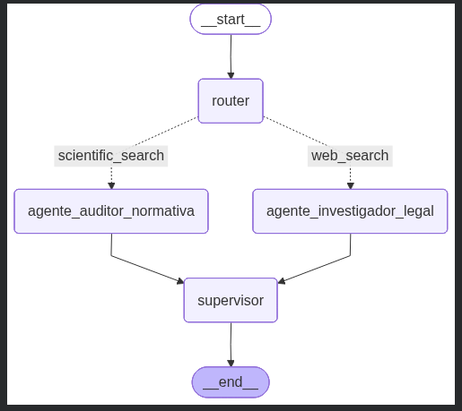
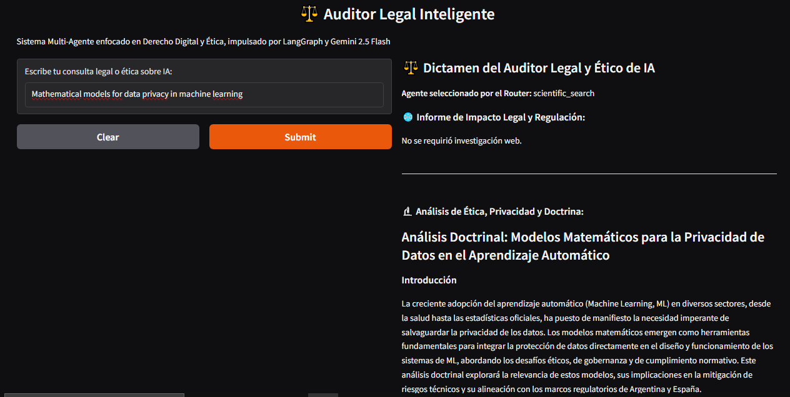
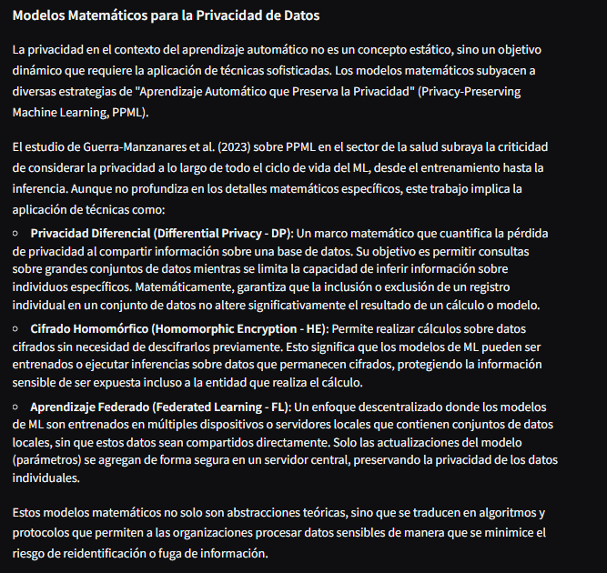
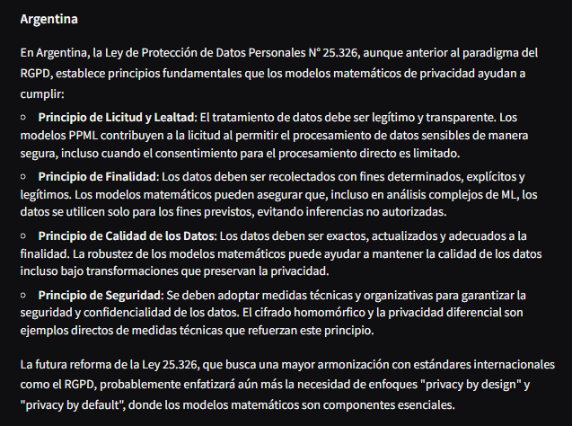
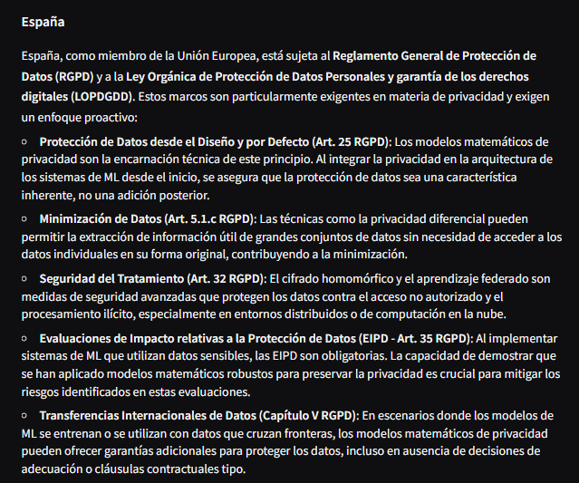
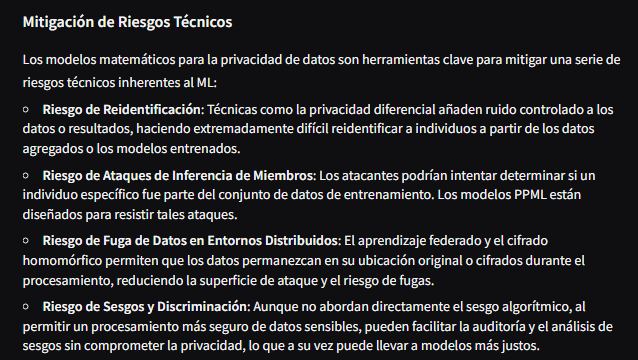
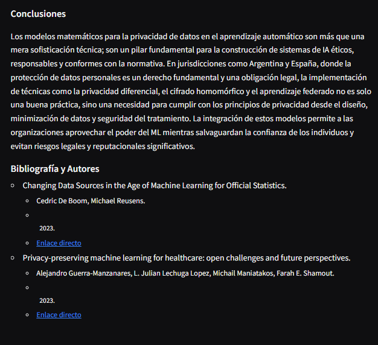
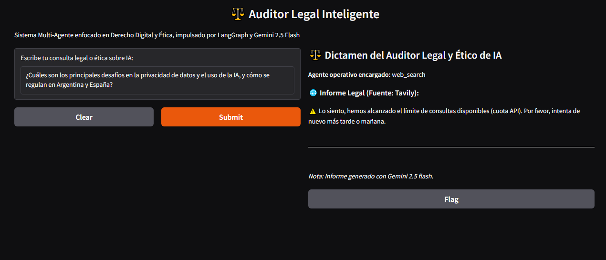

# ⚖️ JurisMind AI: Auditor Ético de IA

## 🔍 Descripción del Proyecto

**JurisMind AI** es un sistema de auditoría inteligente desarrollado para el sector **LegalTech**. Combina la precisión del razonamiento legal con la potencia de la Inteligencia Artificial, permitiendo auditar normativas y doctrina científica mediante un sistema multiagente robusto y trazable.

---

## 🧠 Arquitectura y Lógica

El flujo de trabajo está construido sobre **LangGraph** y **LangChain**, utilizando `TypedDict` para un encapsulamiento seguro de datos y una estructura basada en grafos que garantiza una orquestación dinámica, modular y eficiente.



### 📌 Mapeo de Nodos

#### 🔀 Router
Actúa como el cerebro logístico del sistema. Analiza la consulta del usuario y determina la ruta crítica, enviándola al agente especializado correspondiente.

#### ⚖️ Agente Investigador Legal
Especializado en normativa y regulaciones. Utiliza la herramienta **Tavily Search API** para realizar búsquedas web exhaustivas en tiempo real, garantizando que el análisis legal se base en fuentes actualizadas y verificables.

#### 📚 Agente Auditor Normativa
Se enfoca en el rigor científico. Emplea la API de **arXiv** para acceder a repositorios académicos y extraer doctrina técnica especializada que permita validar los fundamentos científicos detrás de cualquier sistema de IA.

#### 🧩 Supervisor
Nodo coordinador final. Integra los resultados obtenidos por los agentes, verifica la consistencia del análisis y consolida la información en un dictamen ético y legal, manteniendo siempre la trazabilidad de las fuentes utilizadas.

---

## 🚀 Ejecución en Google Colab

### 1️⃣ Abrir el Notebook

Accede al notebook alojado en este repositorio y presiona el botón **"Open in Colab"** incluido dentro del proyecto para ejecutarlo en Google Colab.

### 2️⃣ Configurar las API Keys

Para que el sistema funcione correctamente, debes configurar tus credenciales en la sección **Secrets** (ícono de llave 🔑) de Google Colab:

- `GOOGLE_API_KEY` → Acceso a modelos Gemini.
- `TAVILY_API_KEY` → Búsqueda legal inteligente mediante Tavily.

### 3️⃣ Instalar Dependencias

Ejecuta la primera celda del notebook para preparar el entorno:

```bash
pip install langgraph langchain langchain-google-genai tavily-python arxiv gradio
```

---

## 🔒 Advertencia de Seguridad

**Nunca expongas tus claves de acceso dentro del código fuente.**

Utiliza siempre la gestión de secretos de Google Colab o variables de entorno para mantener protegidas tus credenciales.

---

## 📊 Funcionamiento

El sistema genera un informe consolidado con formato profesional, identificando claramente:

- Fuentes legales consultadas.
- Fuentes científicas utilizadas.
- Herramienta responsable de cada hallazgo.
- Fundamentación jurídica.
- Fundamentación técnica.
- Dictamen ético final.

La arquitectura permite mantener la trazabilidad completa del proceso de auditoría, facilitando la transparencia y la explicabilidad de los resultados.

## 📊 Funcionamiento

JurisMind AI integra análisis legal y científico en una interfaz desarrollada con **Gradio**, permitiendo realizar auditorías éticas y regulatorias de forma simple, transparente y trazable.

### 🖥️ Ejecución del Sistema

La siguiente captura muestra la interfaz de usuario y una respuesta generada por el agente auditor, incluyendo información científica obtenida desde arXiv.



## Modelos Matemáticos para la Privacidad de Datos



## Legislación argentina



## Regulación española



## Migración de Riesgos Técnicos




### 📚 Trazabilidad de Fuentes

El informe final incorpora las conclusiones del análisis junto con las fuentes legales y la doctrina científica consultada, permitiendo verificar el fundamento de cada respuesta generada por el sistema.




### Manejo de Errores y Robustez: 

JurisMind está configurado para gestionar la saturación de solicitudes (Error 429). Esto demuestra un sistema resiliente que prioriza la estabilidad de la conexión y evita la degradación del servicio durante picos de demanda



---

## ⚙️ Stack Tecnológico

### 🔗 Orquestación
- LangGraph
- LangChain

### 🤖 Modelos de IA
- Gemini 2.5 Flash
- Gemini 3.5 Flash

### 🛠️ Herramientas
- Tavily Search API
- arXiv API

### 🎨 Interfaz
- Gradio

### 💻 Entorno
- Google Colab

---

## 🎯 Casos de Uso

- Auditoría ética de sistemas de IA.
- Evaluación de cumplimiento normativo.
- Investigación jurídica asistida por IA.
- Validación científica de modelos inteligentes.
- Elaboración de informes LegalTech.
- Análisis de riesgos regulatorios.

---

## 👩‍⚖️ Sobre la Autora

### Noelia Orsini

**Abogada | Desarrolladora | Counselor**

Profesional con más de 20 años de experiencia en el ámbito jurídico y desarrolladora junior en constante aprendizaje, enfocada en el desarrollo de soluciones de Inteligencia Artificial y LegalTech que integren tecnología, ética y derecho.

🔗 Conecta conmigo en LinkedIn
https://www.linkedin.com/in/noelia-orsini/

---

## 📄 Licencia

Este proyecto fue desarrollado con fines educativos y de investigación dentro del ecosistema LegalTech e Inteligencia Artificial Responsable.
